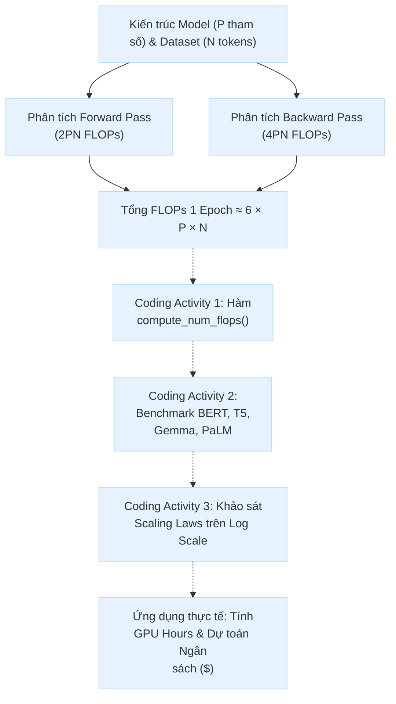
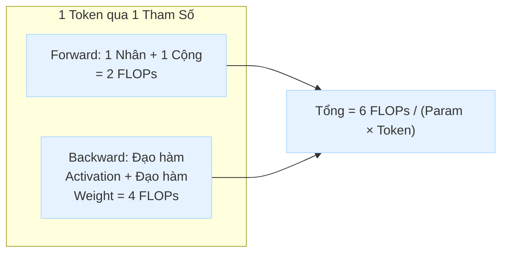

# BẢN ĐỒ LAB
## Đọc trước khi bắt đầu

⏱ **90 phút** | **Trung cấp**

Trong 90 phút, bạn sẽ tìm hiểu cách ước tính chi phí tính toán (Compute Cost) khi huấn luyện các mô hình ngôn ngữ lớn (LLM). Thay vì huấn luyện mô hình gây lãng phí hàng nghìn USD tiền thuê GPU, bạn sẽ sử dụng công thức giải tích chuẩn để dự toán chính xác số lượng FLOPs, từ đó tính ra thời gian chạy trên cụm GPU và chi phí ngân sách.

---

### Bài này đang nói về điều gì?
Trước khi ấn nút huấn luyện một mô hình AI, kỹ sư Machine Learning bắt buộc phải ước tính tài nguyên phần cứng để trả lời 3 câu hỏi: **Tốn bao nhiêu tiền? Phần cứng hiện có chịu nổi không? Mất bao nhiêu ngày/tuần?**

Công thức chuẩn xấp xỉ cho 1 epoch huấn luyện là **FLOPs ≈ 6 × P × N**, trong đó P là số lượng tham số (Parameters) và N là số lượng token dữ liệu huấn luyện.

- Khái niệm FLOPs vs FLOPS
- Giải phẫu Forward & Backward Pass (6PN)
- Lập trình hàm `compute_num_flops`
- Benchmark các mô hình thực tế
- Khảo sát Scaling Laws & Dự toán GPU

---

### Buổi Lab diễn ra như thế nào?
- **0:00–0:15** | Học viên | **Khởi động & Nền tảng FLOPs:** Mở notebook Colab, hiểu rõ định nghĩa FLOPs, phân biệt FLOPs vs FLOPS và ý nghĩa của việc ước tính compute.
- **0:15–0:40** | Học viên | **Hiện thực hoá công thức 6PN:** Tự viết hàm `compute_num_flops` dựa trên cấu trúc Forward Pass (2PN) và Backward Pass (4PN); vượt qua unit test kiểm thử.
- **0:40–1:05** | Học viên | **Tính toán trên các mô hình thực tế:** Áp dụng hàm đã viết để ước lượng chi phí cho BERT-Base, T5-Large, Gemma-1B và PaLM; điền kết quả vào bảng tổng hợp.
- **1:05–1:20** | Học viên | **Khảo sát Scaling Laws (Log Scale):** Tương tác với thanh trượt logarit, quan sát hiện tượng tỉ lệ tuyến tính 1-1 giữa quy mô tham số/dữ liệu với tổng FLOPs.
- **1:20–1:30** | Học viên | **Quy đổi GPU & Đúc kết:** Tính toán số giờ GPU (A100/H100) cần thiết từ số FLOPs, trả lời các câu hỏi tư duy và hoàn thành submission.

### Kết thúc bài, bạn có gì?
- Viết đúng hàm Python tính toán FLOPs và vượt qua bộ kiểm thử tự động của Google DeepMind.
- Hoàn thành bảng tính toán so sánh 4 mô hình thực tế với các cấp độ quy mô từ triệu đến hàng trăm tỷ tham số.
- Biết cách áp dụng kiến thức để tư vấn dung lượng GPU và dự toán chi phí thực tế cho dự án AI.

💡 **Chưa cần lo:**
Bài lab không yêu cầu bạn phải sở hữu GPU đắt tiền vì chúng ta đang học kỹ năng ước tính giải tích trước khi huấn luyện. Hãy đọc kỹ gợi ý, kiểm tra cẩn thận các bậc số mũ (1e6, 1e9, 1e12) và làm theo từng checkpoint.

---

Mở bài thực hành trực tiếp trên Google Colab tại liên kết: **Day 25 – Lab: Estimate Training FLOPs (Colab Notebook)**. Hãy chọn **File → Save a copy in Drive** để lưu bản làm việc riêng về Google Drive cá nhân trước khi bắt đầu thực hiện.

Trong thực tế, chi phí thuê cụm máy chủ GPU (NVIDIA H100, A100) để huấn luyện mô hình ngôn ngữ lớn có thể dao động từ vài nghìn đến hàng chục triệu USD. Nếu bắt tay vào train mà không tính toán trước, bạn có thể đối mặt với:
- 💸 **Hết ngân sách giữa chừng** do tính sai thời gian chạy.
- 💥 **Tràn bộ nhớ (OOM)** hoặc chọn sai số lượng node GPU.
- ⏱ **Dự án trễ hạn** vì thời gian train thực tế gấp 10 lần dự kiến.

Lab này giúp bạn làm chủ công cụ toán học nền tảng để dự toán khối lượng tính toán thông qua chỉ số **FLOPs (Floating-Point Operations)**.



---

### Bảng phân chia sản phẩm cần đạt

| Hạng mục | Hình thức thực hiện | Sản phẩm đầu ra | Hình thức nộp |
| :--- | :--- | :--- | :--- |
| **Activity 1: Hàm FLOPs** | Cá nhân | Hàm `compute_num_flops()` vượt qua test | Link Colab / File `.ipynb` |
| **Activity 2: Benchmark mô hình** | Cá nhân | Bảng dữ liệu `final_results_data` 4 mô hình | Link Colab / File `.ipynb` |
| **Activity 3: Khảo sát Scaling** | Cá nhân | Phân tích quan sát tỉ lệ tuyến tính Log-Log | Link Colab / File `.ipynb` |
| **Ứng dụng & Trả lời câu hỏi** | Cá nhân | Bài tính số giờ GPU H100/A100 và chi phí ($) | Điền trực tiếp vào text cell cuối notebook |

### 📮 Hướng dẫn nộp bài
Vì bài thực hành này chạy 100% trên Google Colab, học viên nộp bài theo **1 trong 2 cách** sau:

**1. Cách 1: Nộp đường link Google Colab (Khuyến nghị):**
- **Bước 1:** Chọn **Runtime → Restart session and run all** để đảm bảo toàn bộ code chạy từ đầu đến cuối không lỗi và lưu lại đầy đủ output (kết quả test, bảng DataFrame).
- **Bước 2:** Bấm nút **Share (Chia sẻ)** ở góc trên bên phải màn hình Colab.
- **Bước 3:** Tại mục *General access (Quyền truy cập chung)*, chuyển sang "**Anyone with the link can view**" (Bất kỳ ai có liên kết đều có thể xem).
- **Bước 4:** Bấm **Copy link** và dán vào form nộp bài / LMS của lớp.

**2. Cách 2: Tải file notebook `.ipynb` về máy:**
- Chọn **File → Download → Download .ipynb**.
- Đặt tên file theo định dạng: `[HoTen]_[MaHV]_Day25_FLOPs.ipynb` và upload lên hệ thống nộp bài LMS.

---

## 2. Bảng giải thích thuật ngữ trực quan

| Thuật ngữ gốc | Bản chất khái niệm | Minh họa trực quan & Ý nghĩa thực tế |
| :--- | :--- | :--- |
| **FLOP (Floating-Point Operation)** | 1 phép tính dấu phẩy động | Phép cộng, trừ, nhân, hoặc chia giữa 2 số thực dạng float (ví dụ: `3.1415 × 0.0234`). |
| **FLOPs (viết hoa s thường)** | Tổng số lượng phép tính | Tổng khối lượng công việc cần làm cho cả đợt huấn luyện (ví dụ: "Huấn luyện mô hình này cần $5 \times 10^{23}$ FLOPs"). Giống như tổng số lít nước trong hồ. |
| **FLOPS (viết hoa S)** | Tốc độ tính toán trên giây (FLOP/s) | Thước đo sức mạnh của phần cứng (Floating-point Operations Per Second). Ví dụ: 1 GPU NVIDIA A100 đạt ~312 TeraFLOPS (FP16). Giống như công suất bơm lít/giây. |
| **Forward Pass (Lan truyền xuôi)** | Tính toán dự đoán đầu ra | Đi qua từng layer Transformer để tính toán activations. Tiêu tốn khoảng **$2 \times P \times N$ FLOPs** (1 phép nhân + 1 phép cộng cho mỗi tham số trên mỗi token). |
| **Backward Pass (Lan truyền ngược)** | Tính Gradient & Cập nhật trọng số | Tính đạo hàm theo activations và đạo hàm theo weights. Tiêu tốn khoảng **$4 \times P \times N$ FLOPs** (gấp đôi Forward Pass). |
| **Epoch** | Một lượt quét hết dữ liệu | 1 Epoch nghĩa là mô hình đã nhìn thấy toàn bộ $N$ tokens trong tập dữ liệu đúng 1 lần. |
| **Scaling Laws (Luật tỉ lệ)** | Quy luật tăng trưởng quy mô | Mối quan hệ hàm mũ / tuyến tính logarit giữa kích thước mô hình ($P$), kích thước dữ liệu ($N$), khối lượng tính toán ($C$) và độ chính xác (Loss). |
| **MFU (Model FLOPs Utilization)** | Hiệu suất phần cứng thực tế | Tỉ lệ % sức mạnh phần cứng được tận dụng thực tế so với công suất lý thuyết (thường chỉ đạt 30% - 50% do nghẽn truyền dữ liệu, giao tiếp giữa các GPU). |

---

## 3. Lộ trình và các Checkpoint quan trọng (90 phút)

| Checkpoint | Thời gian | Mục tiêu trọng tâm | Tiêu chí vượt qua (Pass Criteria) |
| :---: | :---: | :--- | :--- |
| **CP0** 🟦 | 0:00-0:15 (15m) | Mở Colab, cài đặt thư viện `ai-foundations` và kiểm tra môi trường | Cell cài đặt chạy thành công không có lỗi `ModuleNotFoundError` |
| **CP1** 🟩 | 0:15-0:40 (25m) | **Hoàn thành Activity 1:** Viết hàm `compute_num_flops` | Chạy `flops.test_compute_num_flops()` báo **All tests passed!** |
| **CP2** 🟩 | 0:40-1:05 (25m) | **Hoàn thành Activity 2:** Tính toán FLOPs cho 4 mô hình | Bảng `final_results_data` hiển thị đầy đủ, không còn giá trị `...` |
| **CP3** 🟧 | 1:05-1:20 (15m) | **Hoàn thành Activity 3:** Khảo sát Scaling Laws trên Interactive Sliders | Giải thích được tại sao tăng 1 đơn vị log slider lại làm FLOPs tăng 10 lần |
| **CP4** 🟦 | 1:20-1:30 (10m) | **Dự toán thực tế:** Quy đổi ra GPU Hours & Chi phí ($) | Hoàn thiện phần câu hỏi tư duy và nộp link bài làm Colab |

---

## 4. Hướng dẫn chi tiết từng Task (Coding Activities)

### 🔹 Task 0: Thiết lập môi trường & Import thư viện (Checkpoint 0)

1. Mở bài lab trên Google Colab từ link được cung cấp: **Day 25 Colab**.
2. Chọn **File → Save a copy in Drive** để lưu bản sao về Google Drive cá nhân.
3. Chạy cell cài đặt gói phụ trợ từ Google DeepMind:
   ```bash
   !pip install "git+https://github.com/google-deepmind/ai-foundations.git@main"
   ```
4. Chạy cell import các module: `pandas`, `formatting`, `flops`, `display`, `HTML`.

> **[!NOTE]** Colab thực thi trên máy chủ ảo đám mây của Google. Các cell phải được chạy **tuần tự từ trên xuống dưới**. Nếu ngắt kết nối giữa chừng, bạn cần chọn **Runtime → Run before** để nạp lại các hàm trước đó.

---

### 🔹 Task 1 (Coding Activity 1): Hiện thực hoá công thức ước tính FLOPs (Checkpoint 1)

💡 **Ý tưởng cốt lõi**

Tại sao lại là hệ số **6** trong công thức $$\text{FLOPs} \approx 6 \times P \times N$$?

1. **Phép toán Multiply-Accumulate (MAC):**
   - Trong nhân ma trận ($$y = Wx + b$$), mỗi tham số thực hiện 1 phép nhân và 1 phép cộng dồn $$\rightarrow$$ tính là **2 FLOPs** cho mỗi tham số trên mỗi token.

2. **Forward Pass (Lan truyền xuôi):**
   - Mỗi token đi qua toàn bộ $$P$$ tham số một lần: $$\text{FLOPs}_{\text{forward}} \approx 2 \times P \times N$$

3. **Backward Pass (Lan truyền ngược):**
   - Quá trình lan truyền ngược phải thực hiện 2 việc lớn:
     - Tính đạo hàm theo activations để truyền ngược về các layer phía trước ($$\approx 2PN$$).
     - Tính đạo hàm theo weights để cập nhật trọng số ($$\approx 2PN$$).
   - Tổng cộng backward pass tốn gấp đôi forward pass: $$\text{FLOPs}_{\text{backward}} \approx 2 \times \text{FLOPs}_{\text{forward}} \approx 4 \times P \times N$$

4. **Tổng cho 1 training step (1 epoch):**
   - $$\text{Total FLOPs} = \text{FLOPs}_{\text{forward}} + \text{FLOPs}_{\text{backward}} = 2PN + 4PN = 6 \times P \times N$$



❓ **Tại sao phải làm bước này?**

Khi bạn quản lý dự án AI, lãnh đạo sẽ hỏi: *"Train model này mất bao lâu, tốn bao nhiêu tiền?"*. Nếu không biết cách tính FLOPs, bạn sẽ không thể trả lời – dẫn đến nguy cơ vượt ngân sách hoặc chọn sai cấu hình GPU. Hàm `compute_num_flops` chính là công cụ nền tảng cho mọi bài toán dự toán chi phí AI.

🛠️ **Nhiệm vụ của học viên**

Hoàn thiện hàm `compute_num_flops(param_count: float, num_tokens: float) -> float` trong cell tương ứng:

*   **Đầu vào:**
    *   `param_count` (`float`): Tổng số lượng tham số có thể huấn luyện (trainable parameters) của mô hình.
    *   `num_tokens` (`float`): Tổng số lượng token trong tập dữ liệu huấn luyện.
*   **Đầu ra:**
    *   Số thực (`float`) biểu thị tổng số lượng phép tính dấu phẩy động (FLOPs) cho 1 epoch.

> **[!TIP] Gợi ý tự làm:**
> - Không làm tròn số bên trong hàm tính toán để tránh sai số lũy kế.
> - Hãy dựa vào tổng FLOPs của Forward Pass + Backward Pass đã phân tích ở phần lý thuyết trên để xây dựng biểu thức trả về.
> - Sau khi viết xong, hãy chạy cell kiểm thử `flops.test_compute_num_flops(compute_num_flops)` để xác nhận hàm hoạt động chuẩn xác!

---

### 🔹 Task 2 (Coding Activity 2): Tính toán FLOPs cho các mô hình thực tế (Checkpoint 2)

💡 **Ý tưởng cốt lõi**

Bạn được cung cấp thông số thực tế của 4 mô hình nổi tiếng do Google và cộng đồng nghiên cứu phát triển:

1. **BERT-Base** (Devlin et al., 2018):
   - Model parameters: **110 triệu** ($$110 \times 10^6$$ hay `110e6`)
   - Dataset: English Wikipedia + BooksCorpus = **3.3 tỷ tokens** ($$3.3 \times 10^9$$ hay `3.3e9`)

2. **T5-Large** (Raffel et al., 2019):
   - Model parameters: **770 triệu** ($$770 \times 10^6$$ hay `770e6`)
   - Dataset: C4 dataset = **1 nghìn tỷ (trillion) tokens** ($$1 \times 10^{12}$$ hay `1e12`)

3. **Gemma-1B** (Africa Galore):
   - Model parameters: **1 tỷ** ($$1 \times 10^9$$ hay `1e9`)
   - Dataset: Africa Galore = **30 nghìn tokens** ($$30 \times 10^3$$ hay `30e3`)

4. **PaLM** (Chowdhery et al., 2022):
   - Model parameters: **540 tỷ** ($$540 \times 10^9$$ hay `540e9`)
   - Dataset: Massive multilingual corpus = **780 tỷ tokens** ($$780 \times 10^9$$ hay `780e9`)

❓ **Tại sao phải làm bước này?**

Công thức `6PN` trên giấy rất đơn giản, nhưng hiểu được *"con số ấy lớn cỡ nào"* mới là kỹ năng thực tế. Bằng cách tự tay tính cho 4 mô hình có quy mô khác nhau hàng triệu lần, bạn sẽ xây dựng trực giác về mối quan hệ giữa kích thước model, lượng dữ liệu và chi phí compute – điều không thể có được chỉ bằng đọc lý thuyết.

🛠️ **Nhiệm vụ của học viên**

1. Dùng hàm `compute_num_flops` đã tạo ở Task 1 để tính toán giá trị FLOPs cho từng trường hợp.
2. Cẩn thận với các ký hiệu tiền tố mũ trong Python:
   - Nghìn ($$10^3$$): `1e3` (ví dụ `30e3` = 30,000)
   - Triệu ($$10^6$$): `1e6` (ví dụ `110e6` = 110,000,000)
   - Tỷ / Billion ($$10^9$$): `1e9` (ví dụ `3.3e9` = 3,300,000,000)
   - Nghìn tỷ / Trillion ($$10^{12}$$): `1e12` (ví dụ `1e12` = 1,000,000,000,000)
3. Cập nhật biến `final_results_data` trong Colab và hiển thị bảng kết quả hoàn chỉnh bằng `pd.DataFrame`.

❓ **Câu hỏi suy ngẫm sau khi xem bảng kết quả:**

- **So sánh Gemma-1B vs PaLM:** Tại sao Gemma-1B có số lượng tham số lớn hơn BERT-Base ($$1\text{B} > 110\text{M}$$) nhưng tổng FLOPs huấn luyện trên dataset Africa Galore lại nhỏ hơn hàng triệu lần so với BERT-Base?
- **Yếu tố quyết định:** Yếu tố nào có ảnh hưởng mạnh hơn đến tổng chi phí compute: số lượng tham số $$P$$ hay số lượng token $$N$$?

---

### 🔹 Task 3 (Coding Activity 3): Khảo sát Luật tỉ lệ trên Thang đo Logarit (Checkpoint 3)

💡 **Ý tưởng cốt lõi**

Vì quy mô tham số và dữ liệu của LLM tăng trưởng từ hàng triệu ($$10^6$$) lên hàng nghìn tỷ ($$10^{12}$$), biểu đồ đường thông thường sẽ bị biến dạng hoàn toàn (mọi giá trị nhỏ sẽ bị ép bẹp sát đáy trục hoành).

Để quan sát trực quan, các nhà nghiên cứu sử dụng **thang logarit cơ số 10:**

- Mỗi bước nhảy $$+1$$ trên slider (ví dụ từ $$9 \rightarrow 10$$) tương ứng với giá trị thực tế tăng gấp **10 lần** ($$10^9 \rightarrow 10^{10}$$).

❓ **Tại sao phải làm bước này?**

Trong thực tế, khi bạn đọc các bài báo nghiên cứu về Scaling Laws (Kaplan et al. 2020, Hoffmann et al. 2022), mọi biểu đồ đều vẽ trên thang logarit. Nếu không hiểu cách đọc log-scale, bạn sẽ không thể diễn giải đúng kết quả nghiên cứu hoặc so sánh chi phí giữa các mô hình ở các quy mô khác nhau.

🛠️ **Nhiệm vụ của học viên**

1. Kéo thử các thanh trượt `log_param_count` (từ 6 đến 12) và `log_num_tokens` (từ 9 đến 14).
2. Quan sát sự thay đổi của kết quả "Estimated Training FLOPs".
3. **Thực hiện thí nghiệm kiểm chứng:**
   - Cố định `log_num_tokens = 10`.
   - Tăng `log_param_count` từ $$8 \rightarrow 9$$ (tăng 1 bậc).
   - Quan sát số mũ ở kết quả FLOPs: bạn nhận thấy điều gì?
4. **Kết luận:** Đây chính là **Mối quan hệ tỉ lệ tuyến tính 1-1 (Linear Scaling Law)**: Nếu tăng số lượng tham số lên $$k$$ lần (hoặc tăng số lượng token lên $$k$$ lần), tổng khối lượng tính toán FLOPs cũng sẽ tăng chính xác $$k$$ lần.

---

### 🔹 Task 4: Ứng dụng Thực tế – Quy đổi FLOPs sang GPU Hours & Chi phí Tài chính (Checkpoint 4)

Để liên hệ trực tiếp với bài toán kỹ thuật thực tế, hãy áp dụng kết quả tính FLOPs để giải quyết bài toán sau:

📐 **Công thức tính thời gian huấn luyện trên GPU**

$$\text{Training Time (giây)} = \frac{\text{Total Training FLOPs}}{\text{Số lượng GPU} \times \text{Peak FLOPS của GPU} \times \text{MFU}}$$

Trong đó:

- **Peak FLOPS:** Tốc độ xử lý lý thuyết của GPU do nhà sản xuất công bố (ví dụ NVIDIA A100 SXM4 80GB đạt $$\approx 312 \text{ TeraFLOPS} = 312 \times 10^{12} \text{ FLOPS}$$ ở độ chính xác FP16/BF16 Tensor Core).
- **MFU (Model FLOPs Utilization):** Hiệu suất thực tế sau khi trừ hao thời gian truyền dữ liệu qua mạng, nạp bộ nhớ, đồng bộ gradient (trong thực tế thường đạt từ **0.30 đến 0.45**, tức 30%–45%).

📚 **Bài tập tình huống mẫu (Tự tính & Ghi chú vào báo cáo)**

Giả sử công ty bạn cần huấn luyện một mô hình ngôn ngữ **7 tỷ tham số (7B)** trên tập dữ liệu **2 nghìn tỷ tokens (2T tokens)**:

1. **Bước 1:** Tính tổng FLOPs lý thuyết cho 1 epoch huấn luyện ($$6 \times 7\text{e}9 \times 2\text{e}12$$).
2. **Bước 2:** Giả sử bạn thuê cụm **64 GPU NVIDIA A100** (mỗi GPU có Peak 312 TFLOPS) và hệ thống đạt **MFU = 0.35**:
   - Tính tổng năng lực tính toán thực tế của cụm: $$\text{Effective FLOPS} = 64 \times (312 \times 10^{12}) \times 0.35$$.
   - Tính thời gian huấn luyện ra số giờ (GPU Hours) và số ngày thực tế.
3. **Bước 3:** Nếu giá thuê 1 GPU A100 là **$2.50 / giờ**, tổng chi phí tiền điện toán đám mây cho lần train này là bao nhiêu USD?

---

## 5. Bảng khắc phục lỗi thường gặp (Troubleshooting)

| 🔴 Hiện tượng lỗi trên Colab | ❓ Nguyên nhân cốt lõi | ✅ Cách xử lý nhanh |
| :--- | :--- | :--- |
| `ModuleNotFoundError: No module named 'ai_foundations'` | Bạn chưa chạy cell cài đặt package `git+https://github.com/google-deepmind/ai-foundations.git@main` ở đầu notebook. | Chọn lại cell đầu tiên có lệnh `!pip install ...` và bấm nút **Run (▶)**. |
| `NameError: name 'compute_num_flops' is not defined` | Bạn gọi hàm ở cell dưới trước khi chạy cell định nghĩa hàm ở trên. | Bấm chạy cell chứa hàm `def compute_num_flops` trước, sau đó mới chạy cell test hoặc cell tính toán. |
| `AssertionError` khi chạy `flops.test_compute_num_flops` | Công thức tính trong hàm bị sai hệ số (thiếu thành phần Forward hoặc Backward, hoặc nhầm hệ số). | Kiểm tra lại: bạn đã cộng đúng FLOPs của cả Forward Pass lẫn Backward Pass chưa? Tham khảo lại phần lý thuyết ở Task 1. |
| **Giá trị FLOPs tính ra quá nhỏ hoặc quá lớn bất thường** | Nhập sai định dạng số mũ (ví dụ nhập `110` thay vì `110e6`, hoặc `3.3` thay vì `3.3e9`). | Nhớ quy đổi: $$\text{M} = \text{e}6$$, $$\text{B} = \text{e}9$$, $$\text{T} = \text{e}12$$. |
| Colab báo `Session disconnected` hoặc `Kernel died` | Rời màn hình quá lâu khiến Google ngắt kết nối session miễn phí. | Bấm **Reconnect**, sau đó chọn menu **Runtime → Run all** để chạy lại toàn bộ notebook từ đầu. |
